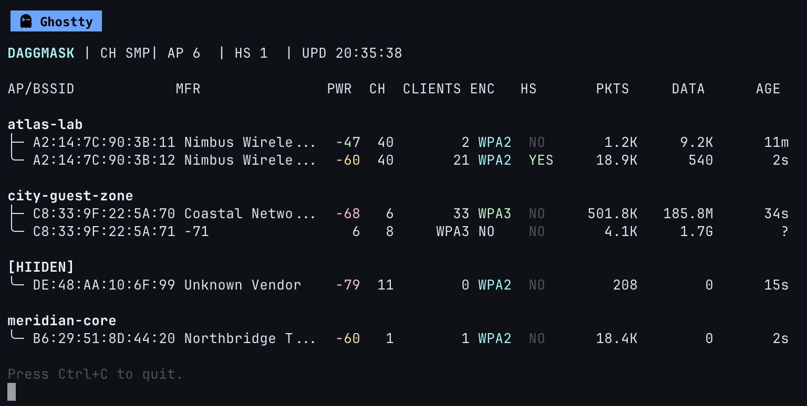

<!-- Improved compatibility of back to top link: See: https://github.com/othneildrew/Best-README-Template/pull/73 -->
<a id="readme-top"></a>

<!-- PROJECT LOGO -->
<br />
<div align="center">
  <a href="https://github.com/GnussonNet/daggmask">
    
  </a>

  <h3 align="center">DAGGMASK</h3>

  <p align="center">
    Live terminal dashboard for grouped Wi-Fi AP visibility from Kismet.
    <br />
    <a href="https://github.com/GnussonNet/daggmask"><strong>Explore the docs »</strong></a>
    <br />
    <br />
    <a href="https://github.com/GnussonNet/daggmask">View Demo</a>
    &middot;
    <a href="https://github.com/GnussonNet/daggmask/issues/new?labels=bug&template=bug-report---.md">Report Bug</a>
    &middot;
    <a href="https://github.com/GnussonNet/daggmask/issues/new?labels=enhancement&template=feature-request---.md">Request Feature</a>
  </p>
</div>


<!-- TABLE OF CONTENTS -->
<details>
  <summary>Table of Contents</summary>
  <ol>
    <li>
      <a href="#about-the-project">About The Project</a>
      <ul>
        <li><a href="#built-with">Built With</a></li>
      </ul>
    </li>
    <li>
      <a href="#getting-started">Getting Started</a>
      <ul>
        <li><a href="#prerequisites">Prerequisites</a></li>
        <li><a href="#installation">Installation</a></li>
      </ul>
    </li>
    <li><a href="#usage">Usage</a></li>
    <li><a href="#roadmap">Roadmap</a></li>
    <li><a href="#contributing">Contributing</a></li>
    <li><a href="#license">License</a></li>
    <li><a href="#contact">Contact</a></li>
    <li><a href="#acknowledgments">Acknowledgments</a></li>
  </ol>
</details>


<!-- ABOUT THE PROJECT -->
## About The Project

[![Product Name Screen Shot][product-screenshot]](https://github.com/GnussonNet/daggmask)

DAGGMASK is a Bash-based live terminal dashboard for Wi-Fi access point telemetry, using Kismet as the capture and analysis backend.

Here's why:
* It gives a fast, operator-friendly grouped view by SSID with AP drill-down rows.
* It keeps Kismet as the long-running service while DAGGMASK stays a lightweight UI client.
* It includes a `--sample-data` mode so layout and behavior can be previewed without Kismet.

The tool is focused on visibility, stability, and clear diagnostics for day-to-day wireless assessment workflows.

<p align="right">(<a href="#readme-top">back to top</a>)</p>


### Built With

* [![Bash][Bash.sh]][Bash-url]
* [![Kismet][Kismet.sh]][Kismet-url]
* [![jq][jq.sh]][jq-url]
* [![curl][curl.sh]][curl-url]

<p align="right">(<a href="#readme-top">back to top</a>)</p>


<!-- GETTING STARTED -->
## Getting Started

Follow these steps to run DAGGMASK locally in either normal Kismet mode or sample/demo mode.

### Prerequisites

Required for Kismet-backed mode:
* kismet
* curl
* jq
* iw
* awk
* perl
* sort

Required for sample mode only:
* awk
* perl
* sort

Example install on Debian/Ubuntu:
  ```sh
  sudo apt update
  sudo apt install -y kismet curl jq iw gawk perl coreutils
  ```

### Installation

1. Clone the repo
   ```sh
   git clone https://github.com/GnussonNet/daggmask.git
   ```
2. Enter the project directory
   ```sh
   cd daggmask
   ```
3. Make the script executable
   ```sh
   chmod +x daggmask.sh
   ```
4. Optional: create a config file
   ```sh
   mkdir -p ~/.config/daggmask
   cat > ~/.config/daggmask/config << 'EOF'
   KISMET_URL=http://127.0.0.1:2501
   API_KEY=your_kismet_cookie_value
   WIFI_IFACE=wlan1mon
   EOF
   ```

<p align="right">(<a href="#readme-top">back to top</a>)</p>


<!-- USAGE EXAMPLES -->
## Usage

Run with defaults/config:

```sh
./daggmask.sh
```

Run with explicit Kismet URL and interface:

```sh
./daggmask.sh --kismet-url http://127.0.0.1:2501 --wifi-iface wlan1mon
```

Run in sample preview mode (no Kismet required):

```sh
./daggmask.sh --sample-data
```

Supported options:

```text
--kismet-url <url>
--api-key <key>
--api-key-file <path>
--wifi-iface <iface>
--sample-data
--config <path>
-h, --help
```

<p align="right">(<a href="#readme-top">back to top</a>)</p>


<!-- ROADMAP -->
## Roadmap

- [x] SSID-first grouping with tree rows
- [x] ANSI-safe aligned columns
- [x] Robust preflight checks and HTTP-aware errors
- [x] `--sample-data` preview mode
- [ ] Optional JSON export mode
- [ ] Optional filtering flags (SSID/BSSID/ENC)

See the [open issues](https://github.com/GnussonNet/daggmask/issues) for a full list of proposed features (and known issues).

<p align="right">(<a href="#readme-top">back to top</a>)</p>


<!-- CONTRIBUTING -->
## Contributing

Contributions are what make the open source community such an amazing place to learn, inspire, and create. Any contributions you make are **greatly appreciated**.

If you have a suggestion that would make this better, please fork the repo and create a pull request. You can also open an issue with the tag "enhancement".

1. Fork the Project
2. Create your Feature Branch (`git checkout -b feature/AmazingFeature`)
3. Commit your Changes (`git commit -m 'Add some AmazingFeature'`)
4. Push to the Branch (`git push origin feature/AmazingFeature`)
5. Open a Pull Request

### Top contributors:

<a href="https://github.com/GnussonNet/daggmask/graphs/contributors">
  
</a>

<p align="right">(<a href="#readme-top">back to top</a>)</p>


<!-- LICENSE -->
## License

Distributed under the MIT License. See `LICENSE` for more information.

<p align="right">(<a href="#readme-top">back to top</a>)</p>


<!-- CONTACT -->
## Contact

Project Link: [https://github.com/GnussonNet/daggmask](https://github.com/GnussonNet/daggmask)

<p align="right">(<a href="#readme-top">back to top</a>)</p>


<!-- ACKNOWLEDGMENTS -->
## Acknowledgments

* [Best README Template](https://github.com/othneildrew/Best-README-Template)
* [Kismet](https://www.kismetwireless.net/)
* [jq](https://jqlang.org/)
* [curl](https://curl.se/)
* [contrib.rocks](https://contrib.rocks/)

<p align="right">(<a href="#readme-top">back to top</a>)</p>


<!-- MARKDOWN LINKS & IMAGES -->
<!-- https://www.markdownguide.org/basic-syntax/#reference-style-links -->
[contributors-shield]: https://img.shields.io/github/contributors/GnussonNet/daggmask.svg?style=for-the-badge
[contributors-url]: https://github.com/GnussonNet/daggmask/graphs/contributors
[forks-shield]: https://img.shields.io/github/forks/GnussonNet/daggmask.svg?style=for-the-badge
[forks-url]: https://github.com/GnussonNet/daggmask/network/members
[stars-shield]: https://img.shields.io/github/stars/GnussonNet/daggmask.svg?style=for-the-badge
[stars-url]: https://github.com/GnussonNet/daggmask/stargazers
[issues-shield]: https://img.shields.io/github/issues/GnussonNet/daggmask.svg?style=for-the-badge
[issues-url]: https://github.com/GnussonNet/daggmask/issues
[license-shield]: https://img.shields.io/github/license/GnussonNet/daggmask.svg?style=for-the-badge
[license-url]: https://github.com/GnussonNet/daggmask/blob/master/LICENSE
[linkedin-shield]: https://img.shields.io/badge/-GitHub-black.svg?style=for-the-badge&logo=github&colorB=555
[linkedin-url]: https://github.com/GnussonNet
[product-screenshot]: images/screenshot.png
[Bash.sh]: https://img.shields.io/badge/Bash-121011?style=for-the-badge&logo=gnubash&logoColor=white
[Bash-url]: https://www.gnu.org/software/bash/
[Kismet.sh]: https://img.shields.io/badge/Kismet-222222?style=for-the-badge&logo=wifi&logoColor=white
[Kismet-url]: https://www.kismetwireless.net/
[jq.sh]: https://img.shields.io/badge/jq-0A3E7E?style=for-the-badge&logoColor=white
[jq-url]: https://jqlang.org/
[curl.sh]: https://img.shields.io/badge/curl-073551?style=for-the-badge&logo=curl&logoColor=white
[curl-url]: https://curl.se/